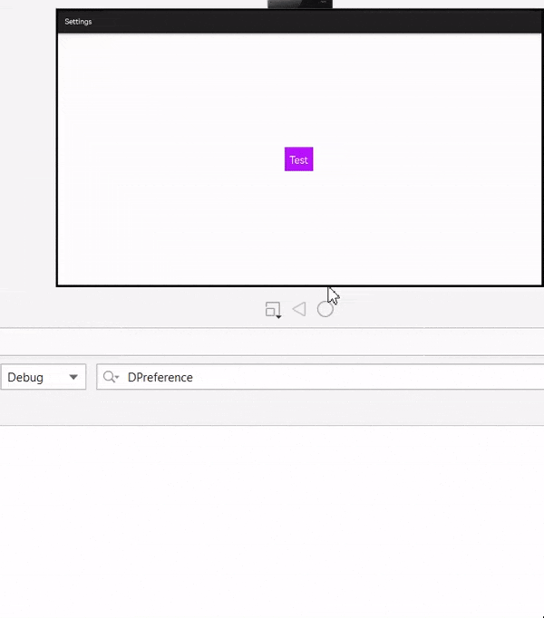

# DPreference
A HMOS library for DPreference.

# Source
Inspired by [Dozen Wang/DPreference](https://github.com/DozenWang/DPreference)

## Features
1. Works multiprocess safely.
2. Similar API like Preferences.
3. DPreference is just a wrapper of original Preferences with data Ability.



## Dependency
1. For using dpreference module in sample app, include the source code and add the below dependencies in entry/build.gradle to generate hap/support.har.
```groovy
    dependencies {
        implementation fileTree(dir: 'libs', include: ['*.jar', '*.har'])
        implementation project(path: ':dpreference')
        testImplementation 'junit:junit:4.13'
        ohosTestImplementation 'com.huawei.ohos.testkit:runner:1.0.0.100'
    }
```
2. For using dpreference in separate application using har file, add the har file in the entry/libs folder and add the dependencies in entry/build.gradle file.
```groovy
	dependencies {
		implementation fileTree(dir: 'libs', include: ['*.har'])
		testImplementation 'junit:junit:4.13'
	}
```

## Usage
```java
    DPreference dPreference = new DPreference(context, "default");
    dPreference.setPrefString( "key", "value");
    dPreference.getPrefString("key", "defaultValue");
```

                                                                                          
                                                  

